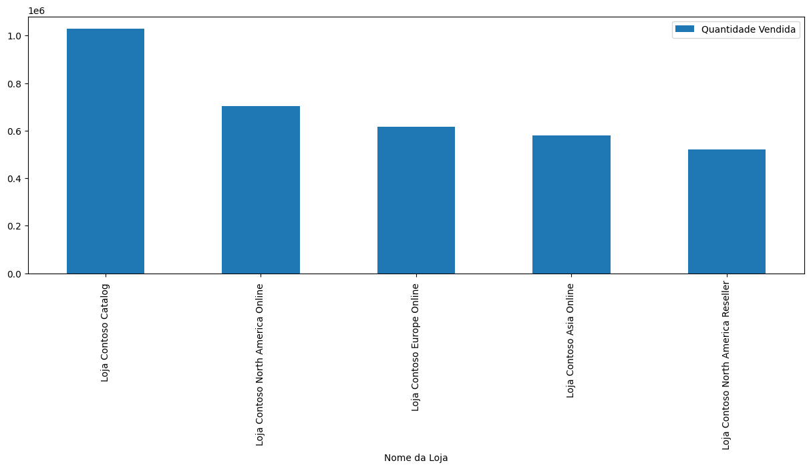

# Análise de Dados: Frequência de Compra por Cliente e Desempenho de Vendas por Loja

Neste projeto, realizamos uma análise exploratória das vendas para entender o comportamento de compra dos clientes e identificar as lojas com o maior volume de vendas.  Utilizamos dados de vendas de uma base fictícia para responder a perguntas como: Qual cliente comprou mais vezes? e Qual loja teve o maior número de vendas?

# Pergunta 1: Qual cliente comprou mais vezes?
Para identificar o cliente mais frequente, usamos o método .value_counts() no campo de email dos clientes, que nos permitiu contar o número de vezes que cada cliente apareceu no conjunto de dados de vendas. Em seguida, plotamos os cinco clientes mais frequentes em um gráfico, visualizando aqueles com o maior número de compras ao longo do período.

# Pergunta 2: Qual loja teve o maior volume de vendas?
Para determinar qual loja teve o maior volume de vendas, agrupamos o DataFrame pelo nome da loja usando o método .groupby(). Em seguida, somamos a quantidade vendida para cada loja e ordenamos os valores de forma decrescente usando .sort_values(). Isso nos permitiu visualizar rapidamente as lojas com os maiores números de vendas. Também geramos um gráfico em barras para os cinco principais resultados, facilitando a interpretação dos dados.

Resultados
Clientes: O cliente com o email karen33@adventure-works.com foi o que mais comprou, com um total de 77 compras.
Lojas: A Loja Contoso Catalog obteve o maior volume de vendas, com uma quantidade vendida de 1.029.117 produtos.
Gráficos
Inserimos gráficos para facilitar a visualização dos dados e identificar rapidamente os principais clientes e lojas. 
Os gráficos mostram as diferenças na frequência de compras e no volume de vendas, fornecendo uma visão clara dos destaques de cada categoria.

